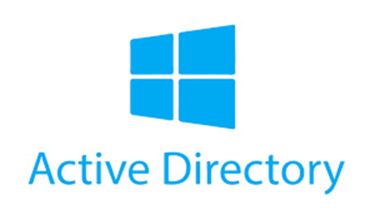

  

# Active Directory Enterprise Administration End-to-End Lab (Azure Virtual Environment)

This project demonstrates the complete deployment and administration of an enterprise-grade Active Directory environment hosted in Microsoft Azure. The lab walks through building a Windows Server domain controller, joining a Windows 10 client to the domain, configuring DNS and networking, and implementing real-world identity and access management operations. It includes creating organizational units, provisioning users, managing security groups, enforcing NTFS and share permissions, applying password and account lockout policies, configuring logon hour restrictions, and performing full user lifecycle operations—from creation to deprovisioning. This end-to-end lab replicates a true corporate IT environment and reinforces essential skills used in IT Support, Systems Administration, and Identity & Access Management roles.

---

## Environments and Technologies Used

- Microsoft Azure
- Windows Server 2022
- Windows 10 Pro Client
- Active Directory Domain Services (AD DS)
- Networking & Protocols
- Tools & Utilities

---

## Table of Contents

- [1) Create Virtual Machines](#1-create-virtual-machines)
- [2) Make the Domain Controllers IP Static](#2-make-the-domain-controllers-ip-address-static)
- [3) Get the Domain Controllers Private IP](#3-get-the-domain-controllers-private-ip-address)
- [4) Attach Client to Domain Controller](#4-attach-the-client-virtual-machine-to-the-domain-controller)
- [5) Log into the Virtual Machines](#5-log-into-the-virtual-machines)
- [6) Install Active Directory Domain Services](#6-install-active-directory-domain-services)
- [7) Promote Server to Domain Controller](#7-promote-server-to-domain-controller)
- [8) Login to the Client Virtual Machine as the Domain Administrator](#8-login-to-the-client-virtual-machine-as-the-domain-administrator)
- [9) Verify Domain Functionality](#9-verify-domain-functionality)
- [10) Enable Remote Dial-In](#10-enable-remote-dial-in-for-non-administrative-users)
- [11) Give Remote Desktop Permissions](#11-give-remote-desktop-permissions-to-domain-users)
- [12) Verify VM Connectivity](#12-verify-the-virtual-machines-are-connected)
- [13) Create Organizational Units](#13-create-organizational-units)
- [14) Create a User](#14-create-a-user)
- [15) Create Security Groups](#15-create-security-groups)
- [16) Assign Folder Permissions](#16-assign-folder-permissions)
- [17) Attempt Folder Access](#17-attempt-to-access-the-folders)
- [18) Upgrade User to Domain Admin](#18-upgrade-user-to-domain-admin)
- [19) Verify Admin Access](#19-verify-admin-access)
- [20) Create Password Policy](#20-create-an-account-password-policy)
- [21) Lockout User Account](#21-lockout-the-users-account)
- [22) Unlock User Account](#22-unlock-the-users-account)
- [23) Reset User Password](#23-reset-the-users-password)
- [24) Verify Functionality](#24-verify-functionality)
- [25) Set Account Logon Hours](#25-set-account-logon-hours)
- [26) Deactivate Account](#26-deactivating-user-accounts)
- [27) Deprovision Account](#27-deprovisioning-user-accounts)

---

### 1) Create Virtual Machines

1. Open **Microsoft Azure** then search **Resource Groups** and select **create** then give the **Resource Group** the following settings then create the **Resource Group**
  - **Name:** RG-01
  - **Reigon:** South Central US

  

2. Search **Virtual Network** and select **create** then give the **Virtual Network** the following settings then create the **Virtual Network**
  - **Resource Group:** RG-01
  - **Name:** VNet-01
  - **Reigon:** South Central US

  

3. Seach **Virtual Machines** then **create** then give the **Virtual Machine** the following settings then create the **Virtual Machine**
  - **Basics**
    - **Resource Group:** RG-01
    - **Name:** DC-01
    - **Image:** Windows Server 2022
    - **Size:** 2vcpus
    - **Username:** userryan
    - **Password:** Cyberlab123!
  - **Networking**
    - **Virtual Network:** VNet-01
   

  
  

  4. Seach **Virtual Machines** then **create** then give the **Virtual Machine** the following settings then create the **Virtual Machine**
  - **Basics**
    - **Resource Group:** RG-01
    - **Name:** Client-1
    - **Image:** Windows 10 Pro
    - **Size:** 2vcpus
    - **Username:** userryan
    - **Password:** Cyberlab123!
  - **Networking**
    - **Virtual Network:** VNet-01
   

  
  
  

---

### 2) Make the Domain Controller's IP Address Static

1. Select the **DC-01 (Domain Controller)** then select **Network Settings** then open the **Network Interface**

  

2. Select **ipconfig1**
3. For Private IP address setting choose **Static** and save changes

  

---

### 3) Get the Domain Controller's Private IP Address

1. Select the **Domain Controller** then open the **Network Settings** tab and find the **Private IP Address**

  

---

### 4) Attach the Client Virtual Machine to the Domain Controller

1. Select **Client-1 (client virtual machine)** then select **Network Settings** and open the **Network Interface**
2. Select **DNS Servers** and choose **Custom**
3. Enter the **DC's Private IP address** and save

  

4. Restart the client VM

---

### 5) Log into the Virtual Machines

1. Search **Virtual Machines** and check under the **Public IP address** tab for the **Domain Controller's Public IP address** and copy it

  

2. In the **Windows search bar** search **RDP** to open the **Remote Desktop Protocol**
3. Where it says **Computer** paste the **Domain Controller's Public IP address**

  

4. When it asks for the login credentials enter:
  - **Username:** userryan
  - **Password:** Cyberlab123!

  

5. To log into the **client virtual machine** copy the **client's public IP address** and follow the same steps

---

### 6) Install Active Directory Domain Services

1. In the **Domain Controller** and open the **Server Manager** then select **Add roles and features**
2. On the **Server Roles** tab check **Active Directory Domain Services** then complete the installation

  

---
### 7) Promote Server to Domain Controller

1. In the **Server Manager** click the **notification flag** and select **Promote this server to a domain controller**

  

2. Choose **Add a new forest** and set the root domain name to **domain.name**

  

3. Set the Directory Services Restore Mode (DSRM) password to **Cyberlab123!** and complete the install and reboot the VMM

---

### 8) Login to the Client Virtual Machine as the Domain Administrator

1. Open the **Remote Desktop Protocol** and enter the **client virtual machine's public IP address**
2. When asked about the username name and password enter
   - **Username:** domain.name\userryan
   - **Password:** Cyberlab123!
  

  

---

### 9) Verify Domain Functionality

1. Log into the **Client Virtual Machine** as the **Domain Administrator** open **Windows PowerShell as an Administrator**
2. Attempt to ping the DC's private IP address using the command **`ping 10.0.0.4`**
  - Your private IP address is most likely different. If you don't remember return to [3) Get the Domain Controllers Private IP](#3-get-the-domain-controllers-private-ip-address)
3. Ensure the ping succeeded

  

4. Enter the command **`ipconfig /all`** into Windows Powershell
5. Confirm the output for the client's DNS settings shows the DC's private IP address

  

---

### 10) Enable Remote Dial-In for Non-Administrative Users

1. In the **Client Virtual Machine** right click the **Start Button** and select **System**
2. Navigate to the **About** page and select **Rename this PC (advanced)** then click **Change**
3. Check the **Member of Domain** box and enter the name of the **domain** and apply the changes

  

---

### 11) Give Remote Desktop Permissions to Domain Users

1. On the **Client Virtual Machine** right click the **Start Button** and select **Computer Management**
2. Go to **Local Users and Groups** and open the **Groups** folder
3. Right-Click **Remote Desktop Users** then **Properties** and click **Add**
4. Type **Domain Users** in the box and click **Check Names**
5. Apply the changes

  

9. Restart the VM

---

### 12) Verify the Virtual Machines are Connected

1. Open the **Server Manager** on the **Domain Controller**
2. Select **Tools** then **Active Directory Users and Computers**

  

3. Expand the **Domain** then click **Computers**
4. The client VM should be inside

  

---

### 13) Create Organizational Units

1. Open the **Server Manager** on the **Domain Controller**
2. Select **Tools** then **Active Directory Users and Computers**
3. Right click the **Domain**
4. Open the **New** submenu
5. Then select **Organizational Unit**

  

6. Create 3 Organizational Units called: Employees, Admins, and Groups

   

---

### 14) Create a User

1. Right click the **Employees** folder
2. Open the **New** submenu
3. Then select **User**

   

4. Name the user **Ryan Kennon**

   

---

### 15) Create Security Groups

1. Open the **Groups** folder
2. Open the **New** submenu
3. Then select **Group**

   

4. Name the Group: Human Resources

   

5. Double click the **Human Resources** security group
6. Select **Members** then select **Add**
7. Enter the name of the user then **Check Names**
8. Apply the changes

   

---

### 16) Assign Folder Permissions

1. On the **Domain Controller** navigate to the **`C: \`**
2. Open the **Properties** for the folder called **HR-ReadWrite**
3. Then select **Sharing** then **Share**

   

4. Then enter **Human Resources** in the box then select **Add**
5. Then click the **dropdown arrow** and select **Read/Write**
6. Confirm the changes

   

7. Do the same for the **HR-ReadOnly** folder except give the Human Resources group **Read** priveleges only.

   

8. For the **AdminsOnly** folder, enter **Domain Admins** in the box before hitting **Add**
9. Select **Read/Write** priveleges for the **Domain Admins**
10. Apply the changes

   

---

### 17) Attempt to Access the Folders

1. **Log into the client VM** using the **credentials of the user** created earlier
2. Open the **File Explorer**
3. On the **Quick Access** bar search **`\\<DC name>`**

   

4. Attempt to access the **HR-ReadWrite** folder and create a new file inside

   

5. Attempt to access the **HR-ReadOnly** folder and attempt to create a new file inside

   

6. Attempt to access the **AdminsOnly** folder

   

---

### 18) Upgrade User to Domain Admin

1. Go back to **Active Directory Users & Computers** on the **Domain Controller**
2. Open the **Employees** folder then right click the user **Ryan Kennon** and select **Properties**
3. Select **Member Of** then **Add**
4. Type **Domain Admin**
5. Then **Check Names**
6. Confirm the changes

   

---

### 19) Verify Admin Access

1. Log back in to the **client VM** using the **user's credentials**
2. Search **`\\DC-01`** in the **Quick Access** bar again
3. Attempt to open the **AdminsOnly** folder and attempt to create a new file inside

   

---

### 20) Create an Account Password Policy

1. On the **Domain Controller** open the **Server Manager**
2. Select **Tools** then **Group Policy Management**

  

3. Navigate through the **Forest** to the **Default Domain Policy**
4. Right click **Default Domain Policy** then choose **Edit**

  

5. In the **Group Policy Management Editor** navigate through the **Policies** folder to the **Password Policy**

  

6. Right-Click **Maximum Password Age** then select **Properties**
7. Change **Password Will Expire In** to **30 days** then **Apply**

  

8. Right-Click **Minimum Password Length** then select **Properties**
9. Change **Password Must Be At Least** to **12 characters** then **Apply**

  

10. Open the **Account Lockout Policy**
11. Right-Click **Account Lockout Threshold** then select **Properties**
12. Change the **Account Will Not Lock Out** to **3 Invalid Login Attempts** then **Apply**

  

13. Right-Click **Account Lockout Duration** then select **Properties**
14. Change the **Account Lockout Duration** to **360 minutes**

  

15. Go back to the **Group Policy Management** page
16. Right-click **Default Domain Policy**
17. Click **Enforced**

  

---

### 21) Lockout the User's Account

1. Attempt to log into the **Client Virtual Machine** using an **incorrect password** four times

  

---

### 22) Unlock the User's Account

1. In the **Domain Controller** open **Active Directory Users and Computers**
2. Double click the user **Ryan Kennon**
3. Click **Account**
4. Check the box labeled **Unlock Account**
5. Apply the Changes

  

---

### 23) Reset the User's Password

1. Right click the user **Ryan Kennon**
2. Select **Reset Password**

  

3. Enter the new password
4. Apply the Changes

  

---

### 24) Verify Functionality

1. Attempt to log into the **Client Virtual Machine** using the updated **user credentials**

  

---

### 25) Set Account Logon Hours

1. On the **Domain Controller** open **Active Directory Users and Computers**
2. Right-click the user **Ryan Kennon** and select **Properties**
3. Navigate to the **Account** tab and click **Logon Hours**
4. Select **Logon Denied** to clear the hours
5. Apply the changes

  

6. Attempt to log into the **Client Virtual Machine** using the **User's Credentials** to observe the change

  

7. On the **Logon Hours** page highlight all the hours and select **Logon Permitted** and apply the changes to reenable sign on

  

---

### 26) Deactivating User Accounts

1. In **Active Directory Users and Computers** right-click the user **Ryan Kennon**
2. Select **Disable Account**

  

3. Attempt to log into the **Client Virtual Machine** using the **User's Credentials** to observe the change

  

4. In **Active Directory Users and Computers** right-click the user
5. Select **Enable Account** to reactive the user account

  

---

### 27) Deprovisioning User Accounts

1. In **Active Directory Users and Computers** right-click the user **Ryan Kennon**
2. Select **Delete**
3. Confirm you want to delete the user

  

4. Attempt to log into the **Client Virtual Machine** using the **User's Credentials** to observe the change

  

